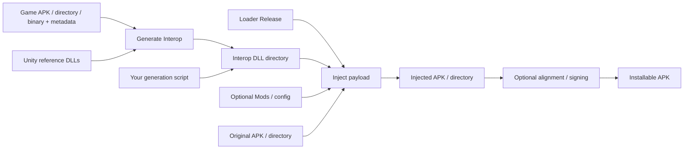

# LemonLoader Patcher

Optional CLI and Avalonia GUI for preparing and injecting LemonLoader into Android
ARM64 Unity IL2CPP games. **LemonLoader does not require Patcher.** The installed
interface is an ordinary file layout: bootstrap library, Loader/runtime assets,
matching game Interop DLLs and optional Mods/config. Scripts and ZIP-entry editors
can produce the same package without Patcher-specific metadata.

## Design and workflow

GUI and CLI call shared Core modules. Each stage consumes files and produces files.
There is no persistent Interop cache or installed Patcher identity gate.



| Command | Inputs | Result |
| --- | --- | --- |
| `generate-interop` | Game APK/directory, or binary + metadata + Unity version | Interop DLL directory; no Loader or APK mutation |
| `inject` | Original game + Loader Release + existing Interop DLLs | Injected APK or in-place directory; no generation/version detection |
| `patch` | Original game + Loader Release | Generate, inject and optionally align/sign; `--interop` skips generation |
| `process-apk` | Any APK + alignment/signing options | Verified aligned/signed APK; no Loader or generator required |
| `unity-dependencies` | Unity version | Exported Unity reference DLL directory |

```powershell
# One-step convenience:
./LemonLoader.Patcher.CLI.exe patch game.apk --output patched.apk --release Loader.zip

# Or call only the stages you need:
./LemonLoader.Patcher.CLI.exe generate-interop game.apk --output GameInterop
./LemonLoader.Patcher.CLI.exe inject game.apk --output patched.apk --release Loader.zip --interop GameInterop
./LemonLoader.Patcher.CLI.exe process-apk patched.apk --output aligned.apk --align
```

Generation calls Cpp2IL, then Il2CppInterop with matching Unity references. Those
tools own generated metadata; Patcher does not rewrite their DLLs. Injection
validates inputs, replaces only the game's libmain.so, adds payload files, and
publishes atomically or rolls back directory changes. Alignment precedes signing,
using Android SDK tools when requested. No stage installs an app.

## Use your own tooling

The [script workflow](docs/WORKFLOW.md) documents generator commands, injection
paths, minimal payload JSON and SDK processing. Replace any stage, use third-party
DLLs without a Patcher manifest, or complete the workflow without these executables.
Loader owns the authoritative
[installed artifact contract](https://github.com/LemonLoaderX/LemonLoader/blob/main/docs/android/ARTIFACTS.md)
and [manual installation guide](https://github.com/LemonLoaderX/LemonLoader/blob/main/docs/android/USAGE.md#manual-injection).

Injection supports original ARM64 Unity games where loading main starts Unity,
with a layout-9 Loader Release. Android/Bionic require API26+; neither adds DEX or
edits the package identity. Existing patched inputs, layout 8, MonoVM, external
helper DEX and 32-bit ABIs are unsupported. Supplied Interop must match the exact
game binary/metadata; no automatic check proves independently supplied DLLs match.

## Start here

- [Patch an APK or directory](docs/USAGE.md)
- [Interop and Unity references](docs/INTEROP.md)
- [Stages and script replacement](docs/WORKFLOW.md)
- [Build, test and maintain](CONTRIBUTING.md)
- [Script catalog](scripts/README.md)
- [Release notes](docs/releases/README.md)
- [Loader installation/runtime guides](https://github.com/LemonLoaderX/LemonLoader/blob/main/docs/README.md)

[Binary releases](https://github.com/LemonLoaderX/LemonLoader.Patcher/releases)
require .NET 10. Download the GUI or CLI archive, then start
LemonLoader.Patcher.GUI.exe or LemonLoader.Patcher.CLI.exe at its root on Windows;
Linux binaries omit .exe. Keep its adjacent Tools directory with the executable.
`patch --help` describes the installed CLI options. Alignment/signing are explicit
operations; the Core patch needs no Android SDK.

## License

[Apache-2.0](LICENSE); bundled tools retain their licenses and source identities.
See [Security](SECURITY.md) for private vulnerability reporting.
